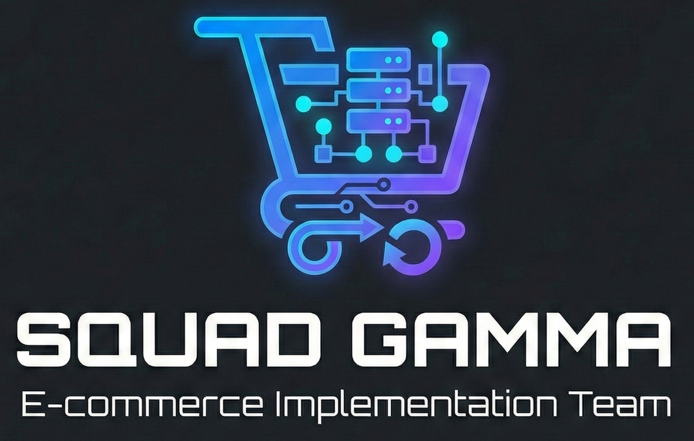

# 🛒 Squad Gamma – E-commerce (Varejo Online)
<p align="center">  </p>
Este repositório contém as implementações das estruturas de dados solicitadas no Desafio de Squads – 25/11/2025, conforme o memorando oficial da Diretoria Técnica.
A Squad Gamma é responsável por desenvolver soluções relacionadas ao fluxo de um e-commerce, utilizando estruturas de dados fundamentais (Listas, Pilhas, Filas e Arrays) implementadas em JavaScript (Node.js).

## 👥 Composição da Squad e Papéis
### 🧭 Tech Lead
- RAFAEL SAMPAIO OLIVEIRA

Responsável pela arquitetura geral, organização do repositório, revisão de Pull Requests e garantia das boas práticas do projeto.

### 🧪 QA Engineer / Tester
- AILTON MEDEIROS RODRIGUES

Responsável por planejamento de testes, validação dos requisitos, testes de estresse e garantia da estabilidade das entregas.

### 🛠️ Software Engineers (Developers)
- ANTÔNIO WILKER SANTOS DA SILVA FILHO
- ISAAC BRUNO BATISTA ARAGÃO
- LAIS LIBÓRIO NEIVA EULÁLIO

Responsáveis pela implementação das estruturas, simulações e resolução das situações-problema.

### 📦 Estruturas Desenvolvidas e Situações-Problema
A Squad Gamma implementou 5 tasks, cada uma representando um módulo comum no ecossistema de um e‑commerce.

## 1️⃣ Carrinho de Compras – Lista Encadeada (LinkedList)
Simula operações de um carrinho, onde o usuário pode adicionar itens e remover produtos de qualquer posição.
A estrutura deve funcionar mesmo quando itens estão indisponíveis.

### 📂 Arquivos
- `01-LinkedList/Node.js` — Nó contendo `{ id, name, price }`
- `01-LinkedList/LinkedList.js` — Implementação completa da lista encadeada
- `01-LinkedList/cartSimulation.js` — Simulação do carrinho

### ✨ Funcionalidades
- Inserção dinâmica de itens
- Remoção por ID (início, meio ou fim)
- Tratamento de remoção inexistente
- Impressão do estado atual do carrinho

## 2️⃣ Vitrine de Promoções – Lista Circular (CircularList)
Simula um carrossel de promoções que rotaciona infinitamente — como banners de lojas online.

### 📂 Arquivos
- `02-CircularList/CircularNode.js`
- `02-CircularList/CircularList.js`
- `02-CircularList/promotionsSimulation.js`

### ✨ Funcionalidades
- Estrutura circular sem fim
- `next()` retorna a próxima promoção automaticamente
- `printCycle(times)` exibe ciclos para debug

### ▶️ Execução
```bash
node 02-CircularList/promotionsSimulation.js
```
## 3️⃣ Botão "Desfazer" – Pilha (Stack)
Simula o comportamento de Ctrl+Z, usando uma pilha (LIFO).

### 📂 Arquivos
- `03-Stack/Stack.js`
- `03-Stack/undoSimulation.js`

### ✨ Funcionalidades
- Histórico de ações
- `undo()` volta ao estado anterior
- Operações: `push`, `pop`, `peek`, `isEmpty`, `size`

### ▶️ Execução
```bash
node 03-Stack/undoSimulation.js
```
## 4️⃣ Processamento de Pedidos – Fila (Queue)
Simula pedidos de e‑commerce sendo processados na ordem de chegada (FIFO).

### 📂 Arquivos
- `04-Queue/Queue.js`
- `04-Queue/orderProcessingSimulation.js`

### ✨ Funcionalidades
- Entrada sequencial de pedidos
- Processamento ordenado
- Tratamento de fila vazia

### ▶️ Execução
```bash
node 04-Queue/orderProcessingSimulation.js
```
## 5️⃣ Comparação de Estruturas – Array vs LinkedList
O catálogo de categorias do site é estático e muito consultado.
A tarefa consiste em justificar por que um Array é melhor que uma LinkedList neste cenário.

## 🎯 Conclusão
- Array → Acesso O(1)
Ideal para dados estáticos com consultas frequentes.

- LinkedList → Acesso O(n)
Precisa percorrer vários nós até encontrar a posição desejada.

### 📂 Arquivo
05-ArrayComparison/comparison.js

▶️ Execução
```bash
node 05-ArrayComparison/comparison.js
```
### 🧪 Testes Automatizados
Todos os módulos possuem testes dedicados na pasta:
```bash
/test
│ main.test.js
│ circularList.test.js
│ stack.test.js
│ queue.test.js
```
### ▶️ Rodar todos os testes individualmente
```bash
node test/main.test.js
node test/circularList.test.js
node test/stack.test.js
node test/queue.test.js
```
### ▶️ Rodar TUDO de uma vez
Com o script:
```bash
runAllTests.js
```
Execute:
```bash
node runAllTests.js
```
## 📁 Estrutura Final do Repositório
```bash
Estruturas-Squad-Gamma/
│
├── 01-LinkedList/
│   ├── Node.js
│   ├── LinkedList.js
│   └── cartSimulation.js
│
├── 02-CircularList/
│   ├── CircularNode.js
│   ├── CircularList.js
│   └── promotionsSimulation.js
│
├── 03-Stack/
│   ├── Stack.js
│   └── undoSimulation.js
│
├── 04-Queue/
│   ├── Queue.js
│   └── orderProcessingSimulation.js
│
├── 05-ArrayComparison/
│   └── comparison.js
│
├── test/
│   ├── main.test.js
│   ├── circularList.test.js
│   ├── stack.test.js
│   └── queue.test.js
│
├── runAllTests.js
├── boilerplate.js
├── CODE_OF_CONDUCT.md
├── CONTRIBUTING.md
├── PULL_REQUEST_TEMPLATE.md
└── README.md
```
## 🌐 Fluxo de Trabalho (Git)
### 🔀 Branches por Task
- feature/linkedlist
- feature/circularlist
- feature/stack
- feature/queue
- feature/arraycomparison

### 📝 Padrão de Commits
- feat: nova funcionalidade
- fix: correções
- test: melhorias nos testes
- docs: atualizações no README

### 👁‍🗨 Revisão
- Todo PR é revisado pelo Tech Lead
- Validação funcional é realizada pelo QA

## 📊 Status das Tasks

| Desafio | Estrutura | Status |
|--------|-----------|--------|
| 1️⃣ Carrinho (LinkedList) | Lista Encadeada | ✅ Concluído |
| 2️⃣ Vitrine (CircularList) | Lista Circular | ✅ Concluído |
| 3️⃣ Desfazer (Stack) | Pilha | ✅ Concluído |
| 4️⃣ Processamento (Queue) | Fila | ✅ Concluído |
| 5️⃣ Comparação Estruturas | Array vs Lista | ✅ Concluído |

Task	Estrutura	Status
1️⃣ LinkedList (Carrinho)	Lista Encadeada	✅ Concluído
2️⃣ CircularList (Vitrine)	Lista Circular	✅ Concluído
3️⃣ Stack (Undo)	Pilha	✅ Concluído
4️⃣ Queue (Pedidos)	Fila	✅ Concluído
5️⃣ Array vs LinkedList	Comparação	✅ Concluído

## 🚀 Conclusão Geral
O projeto simula com fidelidade partes essenciais de um e-commerce, aplicando estruturas de dados fundamentais em situações reais, com:
- modularização clara
- simulações funcionais
- testes robustos
- documentação profissional
- padrões de engenharia (branching, commits, PRs)

A Squad Gamma cumpriu todos os requisitos e entregou um projeto sólido, escalável e bem documentado.

